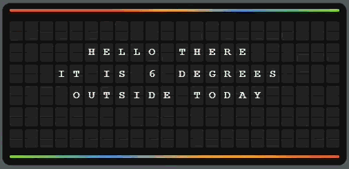

# Split-Flap Card for Home Assistant

A custom Lovelace card that turns your Home Assistant dashboard into a retro split-flap (flip-board) display — the kind you'd see at airports and train stations. Push messages to it from any automation.

Inspired by [FlipOff](https://github.com/magnum6actual/flipoff), a free split-flap display emulator.



## Features

- Realistic split-flap scramble animation — only tiles that change will flip
- Synthesised mechanical flap sound (two sound types: mechanical and soft)
- Driven by an `input_text` helper — any automation can push messages
- Configurable grid size, colours, animation speed
- Visual config editor — no YAML required
- Word wrap with manual line breaks via `|`
- Fully local — no cloud, no subscriptions, no external dependencies
- Works on wall-mounted tablets, phones, and desktop browsers

## Installation

### Manual

1. Download `splitflap-card.js` from this repository
2. Copy it to your Home Assistant `/config/www/` folder
3. Add it as a resource:
   - Go to **Settings → Dashboards → ⋮ (top right) → Resources**
   - Click **Add Resource**
   - URL: `/local/splitflap-card.js`
   - Type: **JavaScript Module**
4. Create an `input_text` helper:
   - Go to **Settings → Devices & Services → Helpers → Create Helper → Text**
   - Name it whatever you like (e.g. "Splitflap Message")
   - Set max length to **132** (6 rows × 22 columns)

## Configuration

### Minimal

```yaml
type: custom:splitflap-card
entity: input_text.splitflap_message
```

### Full options

```yaml
type: custom:splitflap-card
entity: input_text.splitflap_message
title: ""                    # optional heading above the board
rows: 6                      # default 6
columns: 22                  # default 22
font_size: auto              # "auto" scales to card width, or a fixed value e.g. "24px"
scramble_duration: 600       # ms — how long each tile scrambles before settling
stagger_delay: 25            # ms — delay between each tile starting its animation
sound: false                 # enable flip sound (default off)
sound_type: mechanical       # "mechanical" (click + flutter + thud) or "soft" (gentle clack)
accent_color: "#e8572a"      # colour of the top/bottom accent bars
scramble_colors:             # colours shown during the scramble animation
  - "#e8572a"
  - "#f5a623"
  - "#4a90d9"
  - "#7ed321"
  - "#bd10e0"
word_wrap: true              # wrap long text across rows
line_separator: "|"          # character to force a new line in messages
```

All options are also available in the **visual editor** — no YAML needed.

### Sound note

Browsers block auto-playing audio until the user interacts with the page. On a wall-mounted tablet, tap the card once to unlock audio — after that, sounds will play automatically on every message change.

## Pushing messages

The card watches an `input_text` entity. To change what's displayed, just set its value. Use `|` for line breaks.

### From the UI

Go to **Developer Tools → Services** and call:

```yaml
service: input_text.set_value
target:
  entity_id: input_text.splitflap_message
data:
  value: "HELLO WORLD"
```

### From automations

#### Morning weather greeting

```yaml
automation:
  - alias: "Splitflap Morning Weather"
    trigger:
      - platform: time
        at: "07:00:00"
    action:
      - service: input_text.set_value
        target:
          entity_id: input_text.splitflap_message
        data:
          value: >-
            GOOD MORNING|IT IS {{ states('sensor.outside_temperature') | round(0) }} DEGREES|OUTSIDE TODAY
```

#### Doorbell alert

```yaml
  - alias: "Splitflap Doorbell"
    trigger:
      - platform: state
        entity_id: binary_sensor.front_door_motion
        to: "on"
    action:
      - service: input_text.set_value
        target:
          entity_id: input_text.splitflap_message
        data:
          value: "SOMEONE IS|AT THE DOOR"
```

#### Live sensor display

```yaml
  - alias: "Splitflap Live Temp"
    trigger:
      - platform: state
        entity_id: sensor.outside_temperature
    action:
      - service: input_text.set_value
        target:
          entity_id: input_text.splitflap_message
        data:
          value: >-
            {{ now().strftime('%A').upper() }} {{ now().strftime('%H:%M') }}|{{ states('sensor.outside_temperature') | round(0) }} DEGREES OUTSIDE
```

Any automation that can call `input_text.set_value` can push messages to the board — weather, calendar events, appliance notifications, solar generation, you name it.

## Updating

When you replace the JS file, your browser may cache the old version. To force a reload, add a version query string to your resource URL:

```
/local/splitflap-card.js?v=2
```

Bump the number each time you update the file, then hard refresh (Ctrl+F5) your dashboard.

## Credits

- Inspired by [FlipOff](https://github.com/magnum6actual/flipoff) by magnum6actual
- Built with the help of [Claude](https://claude.ai) by Anthropic

## License

MIT
